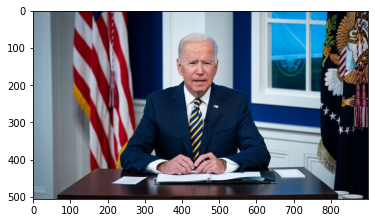

# Simple Video Filter

**some video filters with AI**

## complete：
### 1.segmentation filter
use [**mediapipe**](https://google.github.io/mediapipe/) on cpu 
[**[colab]**](https://colab.research.google.com/drive/1SE2JdqkBDvYHc6XcYEpjwfYNxctR6EkO?usp=sharing) 

## plane:
### 2.depth filter
