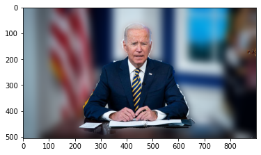
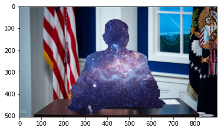
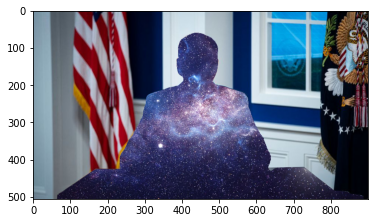

# Simple Video Filter

**some video filters with AI**<br>
[YouTube](https://youtu.be/cIlo7bsU5zo)

## complete：
### 1.segmentation filter(CPU)
use [**mediapipe**](https://google.github.io/mediapipe/) on CPU<br>
[**[colab]**](https://colab.research.google.com/drive/1SE2JdqkBDvYHc6XcYEpjwfYNxctR6EkO?usp=sharing)<br>



### 2.depth filter(GPU)
use **Monocular Depth Estimation** model [**MiDaS**](https://github.com/isl-org/MiDaS) on GPU<br>
[**[colab]**](https://colab.research.google.com/drive/1_85OV4gQRv8FFykLKREi-FwusOO0t7z7?usp=sharing)<br>



## plan:
. segmentation filter(GPU)<br>
. some face filter<br>
. sends frames to a virtual camera

## install:
```
git clone https://github.com/geturin/simple_VideoFilter.git
pip install -r package.txt
```
with depth filter(GPU),need install pytorch and CUDA<br>
[**pytorch**](https://pytorch.org/get-started/locally/)<br>
[**CUDA**](https://developer.nvidia.com/accelerated-computing-toolkit)

## run:
**like**
```
python main.py -filter_model segmentation -filter_target 1 -background images/universe.png  
```

-filter_model : <br>
segmentation<br>
depth

-filter_target:<br>
0  background<br>
1  human

-background:<br>
your background image path<br>
if have not backgroud will use Gaussian blur